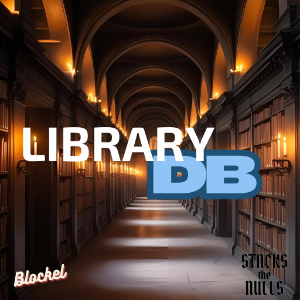
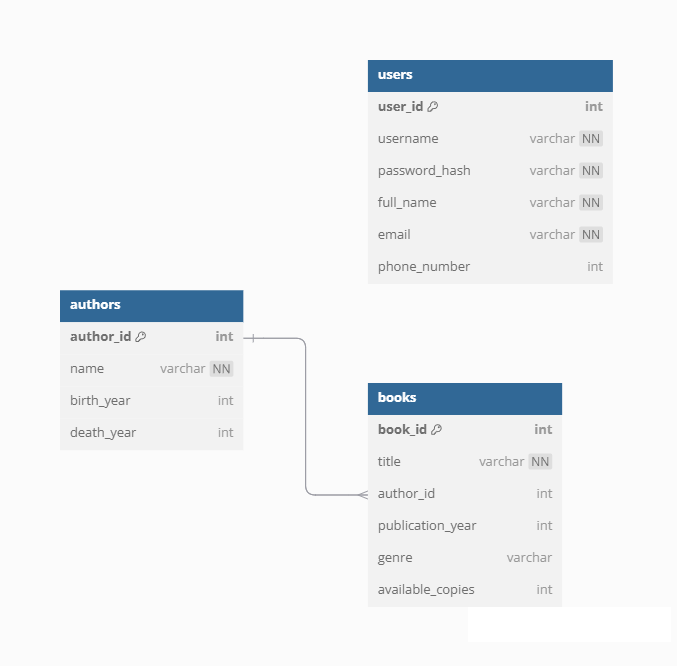
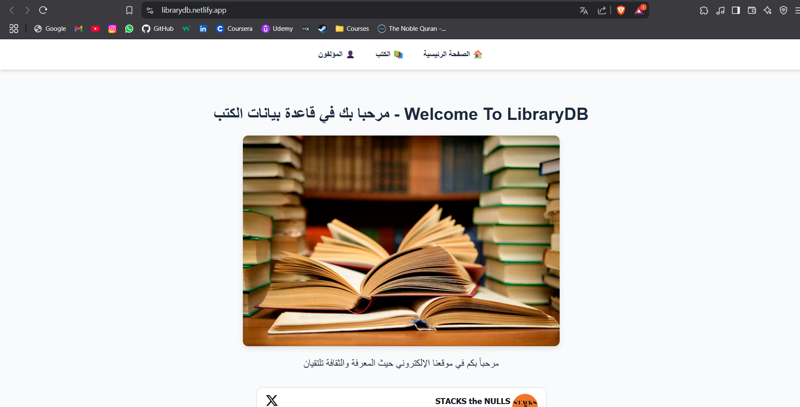

# LibraryAPP
Web-app based on [LibraryDB](https://github.com/Saad711T/LibraryDB) A relational database for library website using by users.



## Project Section
- `LibraryDB` : Relational database project begin in Sep 2024 .

```sql
-- Content of LibraryDB.sql

CREATE TABLE authors (
    author_id INT AUTO_INCREMENT PRIMARY KEY,
    name VARCHAR(100) NOT NULL ,
    birth_year INT(11)DEFAULT NULL ,
    death_year INT(11)DEFAULT NULL
);

CREATE TABLE books (
    book_id INT AUTO_INCREMENT PRIMARY KEY,
    title VARCHAR(255) NOT NULL,
    author_id INT,
    publication_year INT,
    genre VARCHAR(50),
    available_copies INT,
    FOREIGN KEY (author_id) REFERENCES authors(author_id)
);

CREATE TABLE users (
    user_id INT AUTO_INCREMENT PRIMARY KEY,
    username VARCHAR(50) NOT NULL,
    password_hash VARCHAR(255)NOT NULL,
    full_name VARCHAR(100)NOT NULL,
    email VARCHAR(100) NOT NULL ,
    phone_number INT(15) DEFAULT NULL
);

```
### ER Model


- `LibraryWB` : Website for this database is online now on [Link](https://librarydb.netlify.app) .
### Website Screenshot


- `LibraryAPP` : Full project contains : (Website - Android/iOS app versions for website - Database) .

## Credits :
- STACKS the NULLS Team
- Dev.Saad Almalki