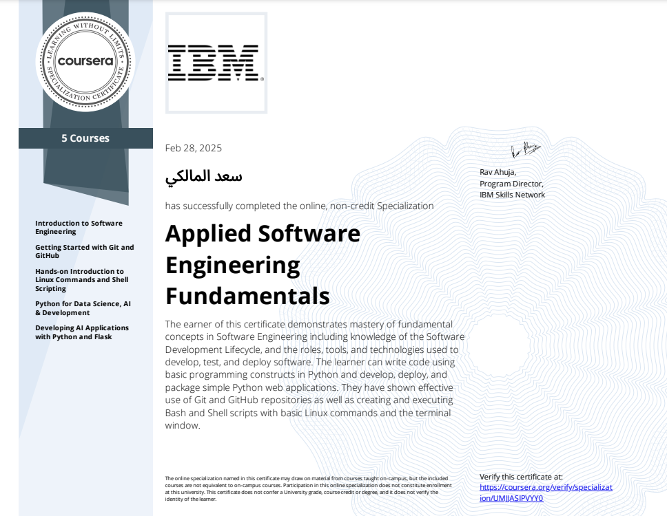

# Software-Engineering
This repo using for software development/engineering sandbox , U should be found a lot of bugs and unend softwares, don't worry .

## IBM Projects
Projects as part of (Applied Software Engineering Fundamentals Specialization) & (IBM Full Stack Developer)
- [IBM - Git and Github](https://github.com/Saad711T/IBM-Git-and-Github) **Python - Markdown**
- [IBM - Linux Commands and Shell Scripting ](https://github.com/Saad711T/IBM-Linux-Commands-and-Shell-Scripting) **Shell(Bash)**
- [IBM - Emotion Detector](https://github.com/Saad711T/IBM-EmotionDetector) **Python(Flask) - HTML - Javascript**

